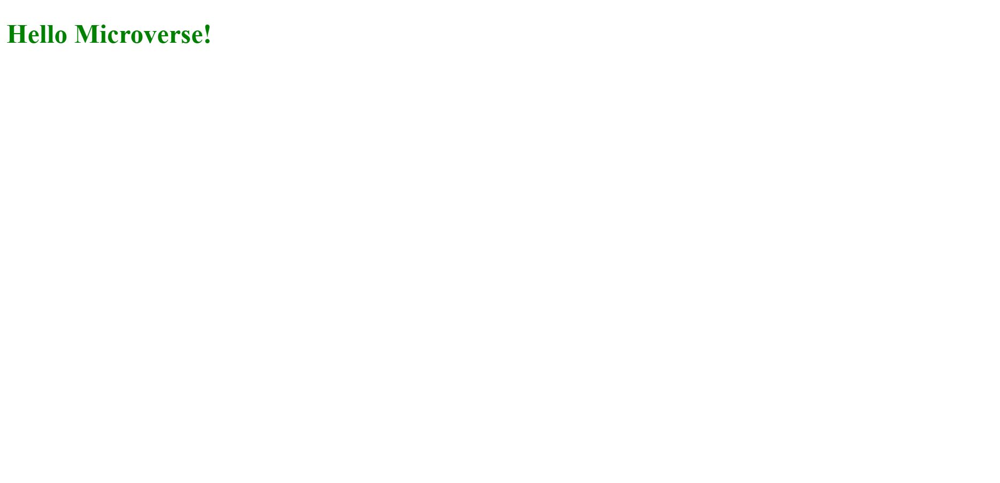

# Hello Microverse

Set up the first project for Microverse. Learning Objectives:

- Create branches with different base branches.
- Understand the concept of version control.
- Follow Gitflow.
- Open pull requests in GitHub.
- Write descriptive, easy to understand commit messages.
- Write short, detailed, easy to understand descriptions of pull requests.
- Write a descriptive and easy to understand README in business English for every project submitted.
- Demonstrate an ability to submit a project for code review.

## Built With

- HTML/CSS
- Node.js

## Live Demo

## Getting Started

To get a local copy up and running follow these simple example steps.
- Clone repo into your machine. For this, I recommend the following steps:
  - Open a terminal of your choice (e.g. VS Code integrated terminal).
  - Select the destination folder (On windows, run cd "*Destination folder*")
  - Run git clone https://github.com/dicodiaz/Hello-Microverse
- Open the destination folder in your preferred file explorer.
- Open folder "Hello-Microverse"
- Open index.html

### Prerequisites

Any web browser will do.

### Setup

Clone repo into your machine.

### Install

N/A

### Usage

N/A

### Run tests

N/A

### Deployment

N/A

## Authors

👤 **Dico Diaz Dussan**

- GitHub: [@dicodiaz](https://github.com/dicodiaz)
- Twitter: [@DicoDiaz1](https://twitter.com/DicoDiaz1)
- LinkedIn: [Dico Diaz Dussan](https://www.linkedin.com/in/dico-diaz-dussan)

## 🤝 Contributing

Contributions, issues, and feature requests are welcome!

## Show your support

Give a ⭐️ if you like this project!

## Acknowledgments

My learning partners and my stand-up team partners.

## 📝 License

This project is [MIT](./MIT.md) licensed.
